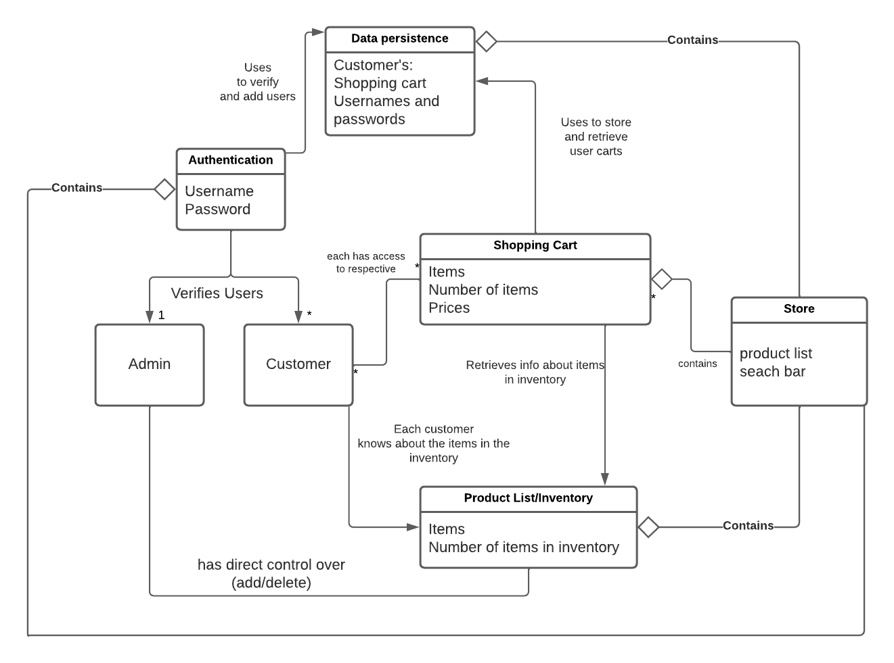

# PROJECT Design Documentation

> _The following template provides the headings for your Design
> Documentation.  As you edit each section make sure you remove these
> commentary 'blockquotes'; the lines that start with a > character
> and appear in the generated PDF in italics._

## Team Information
* Team name: 7INTHEMORNING
* Team members
  * Aydan Reyes
  * Khandaker Fahmid
  * Quan Quy
  * Shengxing Wu
  * Elijah Thibodeau

## Executive Summary

With the formation of our team, we selected water products to apply our application too
and are tasked with building an e-store in which customers can log in and out, while 
browsing a list of products currently in the inventory of the store and add/remove these 
items from their shopping cart. For the owners, they will be able to edit quantities and
remove/add products all together from the store.

### Purpose
> _Provide a very brief statement about the project and the most
> important user group and user goals._

The purpose of this project is to create an e-commerce website teaching us the fundamentals
of software engineering and working with a team to complete the tasks at hand. Our goals consist
of completing well planned and though out code that benefits the final product and what is desired
by our product owner.

### Glossary and Acronyms
> _Provide a table of terms and acronyms._

| Term | Definition |
|------|------------|
| SPA | Single Page |

## Requirements

This section describes the features of the application.

> _In this section you do not need to be exhaustive and list every
> story.  Focus on top-level features from the Vision document and
> maybe Epics and critical Stories._

### Definition of MVP
> _Provide a simple description of the Minimum Viable Product._

The MVP is a basic e-commerce site developed using Angular, SPRING,
HTML, Typescript and probably something I'm forgetting. The point of
the website is to allow vendors to sell products and provide users with
an easy to use and understand experience where they can sign in and out
and access a shopping cart to checkout.

### MVP Features
- Admin
- Customer
- Store Interface
- Shopping Cart
- Data Persistance
- Checkout
- Authentication
- Product List

### Roadmap of Enhancements
- More navigability
- Checkout
- Visual Elements to products list
- Product Review Feature
- Rewards
- Coupons/Featured Products.

## Application Domain

This section describes the application domain.

> _Provide a high-level overview of the domain for this application. You
> can discuss the more important domain entities and their relationship
> to each other._

## Architecture and Design

This section describes the application architecture.

### Summary

The following Tiers/Layers model shows a high-level view of the webapp's architecture.

The e-store web application, is built using the Model–View–ViewModel (MVVM) architecture pattern. 

The Model stores the application data objects including any functionality to provide persistance. 

The View is the client-side SPA built with Angular utilizing HTML, CSS and TypeScript. The ViewModel provides RESTful APIs to the client (View) as well as any logic required to manipulate the data objects from the Model.

Both the ViewModel and Model are built using Java and Spring Framework. Details of the components within these tiers are supplied below.

### Overview of User Interface

This section describes the web interface flow; this is how the user views and interacts
with the e-store application.

> _Provide a summary of the application's user interface.  Describe, from
> the user's perspective, the flow of the pages in the web application._

When opening the website, the user is greeted with our user authentication page
in which they are prompted to enter their username and password. If they are a 
new user there is a Sign Up? option under the textbox prompts. After signing in
the user is then sent to the main page of the website where a product list is 
displayed and they can view prices. At the top of the page a searh bar is visible
and can be used to search strings such as "dis" or "flav" to find specific products
or products of a certain category. When using the search bar they user can also leave
the bar empty and return to the main page containing the product list. When adding
the products to the users shopping cart there is a visible cap on each product when
adding and they can select an amount up to that cap. After adding the item to the
cart the user can then use the shopping cart button to view their contents and where
they can decide to continue to checkout(coming soon) or remove product with a specific
quantity from their cart. After a user is done with their shopping they can log out
the site and when they are ready to come back the items they've left in their cart
will still be there when they return as long as they are still available within the
stores inventory.

### View Tier
> _Provide a summary of the View Tier UI of your architecture.
> Describe the types of components in the tier and describe their
> responsibilities.  This should be a narrative description, i.e. it has
> a flow or "story line" that the reader can follow._

> _You must also provide sequence diagrams as is relevant to a particular aspects 
> of the design that you are describing.  For example, in e-store you might create a 
> sequence diagram of a customer searching for an item and adding to their cart. 
> Be sure to include an relevant HTTP reuqests from the client-side to the server-side 
> to help illustrate the end-to-end flow._

When looking at the architecture of our view tier we can look at the code that makes up
our user interface. Each portion of the UI has a respective directory/folder such admin
and search bar where the html is written to be interacted with for use by the customer
and admin. Each piece is designed to be updatable and adaptable with what is to be added
in the future and as new things are added in the ViewModel and Model they are to be added
here. For the authentication ui, this interactes with the UserController which accesses
the authentication model to complete the desired request. Similarly throughout the project
things like User and Product Controller are pieces used in parts of the UI like the shopping
cart, product list, search bar, and admin inventory that interact with their respective models
to complete their respective tasks with high cohesion and low coupling as these interact through 
each other and not directly to each class being used.

### ViewModel Tier
> _Provide a summary of this tier of your architecture. This
> section will follow the same instructions that are given for the View
> Tier above._

> _At appropriate places as part of this narrative provide one or more
> static models (UML class diagrams) with some details such as critical attributes and methods._

For the ViewModel Tier this is our data persistance and Controller classes that are responsible
for interacting with the Model classes that use the data stored in our data persistance classes 
such as usernames, carts, ids, and products. Our structures for our data persistence is focuses
on three main parts of the project, that being products, users, and user authentication. Product
and User both use a header file of sorts referred to as UserDAO and ProductDAO that interact with
UserFileDAO that actually does the desired computing, this allows for us to maintain low coupling
while remaining efficient.

### Model Tier
> _Provide a summary of this tier of your architecture. This
> section will follow the same instructions that are given for the View
> Tier above._

> _At appropriate places as part of this narrative provide one or more
> static models (UML class diagrams) with some details such as critical attributes and methods._

The model tier is where we create the products, users, items in cart, and the user authentication
for the other parts of the project. Each class has respective functions to retrieve different parts
of the objects that are created when User user is used to create a customer or Product product.

### Static Code Analysis/Design Improvements
> _Discuss design improvements that you would make if the project were
> to continue. These improvement should be based on your direct
> analysis of where there are problems in the code base which could be
> addressed with design changes, and describe those suggested design
> improvements._

Coming into the end of the sprint, a few of us realized how close
it was getting to the due date and started to rush out code fixes
pushing the dreaded spaghetti code into the mix with our other well
written functions and classes. This issue will be addressed in the
upcoming sprint and meeting to discuss what we can do

> _With the results from the Static Code Analysis exercise, 
> discuss the resulting issues/metrics measurements along with your analysis
> and recommendations for further improvements. Where relevant, include 
> screenshots from the tool and/or corresponding source code that was flagged._

## Testing
For testing we just jumped right in attempting to break withs like anyone really
would. Messing around, spamming things like the enter key when searching for
products trying to go about breaking the program. Instead we did run in to some
general bugs that were easy to fix relating to have to click log in twice when
entering information and a bug with removing items from the cart.

### Acceptance Testing
Doing the demo recording and rewriting all of the user stories out
again for the acceptance testing allowed us to make sure all our
bases were covered when testing. Every test we ran passed close
to flying colors with a few hiccups in deleting items from carts
which was quickly resolved.

### Unit Testing and Code Coverage
> _Discuss your unit testing strategy. Report on the code coverage
> achieved from unit testing of the code base. Discuss the team's
> coverage targets, why you selected those values, and how well your
> code coverage met your targets. If there are any anomalies, discuss
> those._

For our unit testing strategy we followed the examples given in the
lecture and from the heroes api tutorial that allowed us to quickly
identify what needed to be tested and how to go about testing it. Some
classes did have some lacking coverage with our lowest being 90% which
isn't horrible but definitely needs to be addressed. For the rest of 
the testing each class hit its mark with the other lowest being 96% 
which was for the UserController basically right on the mark with where
it should be.
